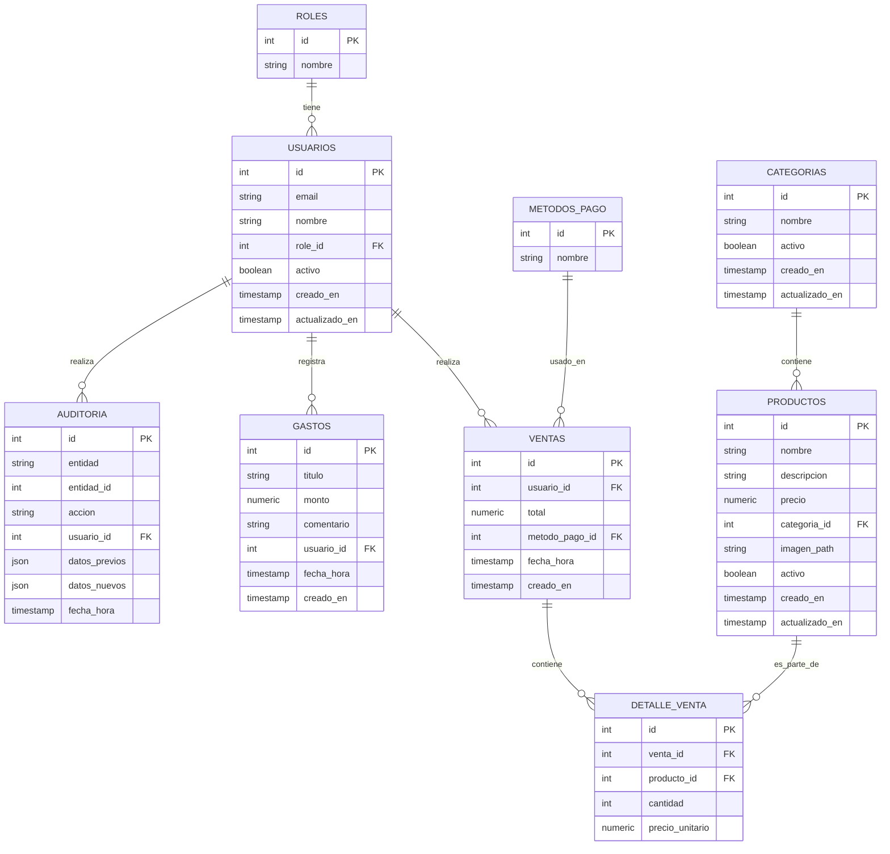

# Modelo Entidad-Relación (ER)

Fecha: 2026-07-09

Este documento describe el modelo entidad-relación mínimo para el sistema POS.

## Tablas principales y atributos

- usuarios: id (PK), email, nombre, role_id (FK), activo, creado_en, actualizado_en
- roles: id (PK), nombre
- categorias: id (PK), nombre, activo, creado_en, actualizado_en
- productos: id (PK), nombre, descripcion, precio, categoria_id (FK), imagen_path, activo, creado_en, actualizado_en
- ventas: id (PK), usuario_id (FK), total, metodo_pago_id (FK), fecha_hora, creado_en
- detalle_venta: id (PK), venta_id (FK), producto_id (FK), cantidad, precio_unitario
- gastos: id (PK), titulo, monto, comentario, usuario_id (FK), fecha_hora, creado_en
- metodos_pago: id (PK), nombre
- auditoria: id (PK), entidad, entidad_id, accion, usuario_id (FK), datos_previos, datos_nuevos, fecha_hora

## Relaciones clave
- `usuarios.role_id` -> `roles.id`
- `productos.categoria_id` -> `categorias.id`
- `ventas.usuario_id` -> `usuarios.id`
- `ventas.metodo_pago_id` -> `metodos_pago.id`
- `detalle_venta.venta_id` -> `ventas.id`
- `detalle_venta.producto_id` -> `productos.id`
- `gastos.usuario_id` -> `usuarios.id`
- `auditoria.usuario_id` -> `usuarios.id`

## Reglas y consideraciones
- No eliminar físicamente: usar `activo` parasoft-delete.
- Auditoría: registrar cambios críticos en `auditoria`.
- RLS: aplicar políticas por rol (vendedor solo puede crear ventas/gastos; administrador puede CRUD completo).

## Diagrama ER (Mermaid)

## Siguientes pasos
- Generar el script SQL de creación de las tablas con índices, restricciones FK y triggers básicos para auditoría.
